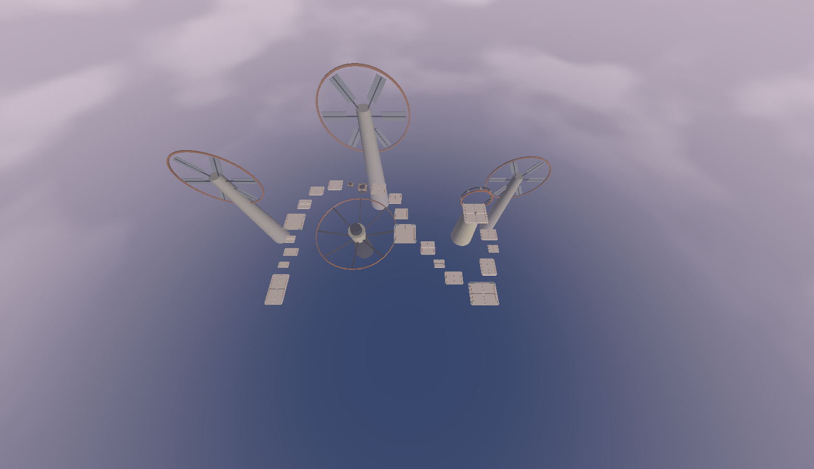
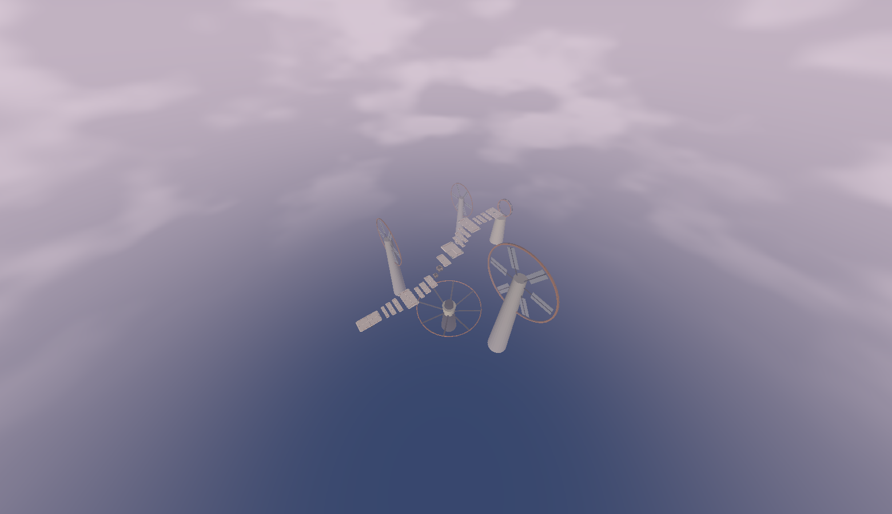

# 0.16.2 - Windward flow sequences

The latest S23 feedback says shared bhop/air-strafe can feel excellent, but
alternating route corrections compound small landing errors. This pass reauthors
Windward only, around four sustained movement ideas. It is content version 6.
All motor, movement profile, touch/manual camera, soundtrack and fatal-scenery
source/assets remain unchanged. No 3DAIStudio art-production work was begun.

## Before / after

Before: a compact loop with successive direction changes and a largely uniform
gap rule. After: a legible outward progression through four sequences, separated
by three existing Restore identities. The two obsolete arc.07 / arc.08 platforms
are removed. The arrival runway is retained; all following supports are repositioned or resized. There are 20
supports, including two pressure fins and five large anchors. The old separate
chord remains removed. Dark foundations remain only at anchors. Wind sails,
instrument and telescope are displaced out of the central route sightlines.

## Movement sequences and shared lines

1. **Acceleration:** a straight 14 m arrival runway, three wide intermediate
   catches, then west Restore. Slow uses A/B/C. Flow bypasses A, lands B, then
   bypasses C into Restore. Expert bypasses A and B, lands C, then Restore.
2. **Sustained left sweep:** six gradually curving catches, with two existing
   pressure fins, then east Restore. Slow uses all six. Flow lands 02, 03, 05,
   06; expert lands 02, 04, 06. Each then lands at the same recovery terrace.
3. **Rising diagonal:** the heading continues the sweep through three shallow
   rises into lens Restore. Slow uses A/B/C. Flow skips A and uses B/C. Expert
   uses B and skips C into the broad inside catch of the recovery terrace.
4. **Final carry:** straighten on lens Restore, then three catches toward the
   telescope/Patch. Slow uses A/B/C. Flow uses B/C; expert uses B then Patch.

All line descriptions above are observed clean fixture landings on identical
geometry. Within each sequence, adjacent centreline heading changes remain below
15 degrees. Lateral catch widths are 9-14 m on intermediate platforms, while
longitudinal depths vary from 2-6 m. Gaps vary with the flight/landing requirements;
there is no universal gap target. The five larger spaces serve arrival, recovery
and finish. No extra route, hidden guidance, steering assistance or velocity
correction was added to gameplay.

## Representative measured sequence flights

| Sequence | Slow flight | Flow flight | Expert flight |
| --- | --- | --- | --- |
| Acceleration | 3.89-4.60 m | 8.52-8.75 m | 10.65-10.94 m |
| Sweep | 4.47-4.60 m | 8.52-8.75 m | 10.65-10.94 m |
| Diagonal | 4.47-4.67 m | 7.93-8.21 m | 10.30-10.35 m |
| Final carry | 4.60 m | 8.44 m | 10.94 m |

Slow pilots approach at ordinary speed, release hold, stop between landings, and
use a fixed direction during each jump. Recorded takeoff speeds span 0-6.12 m/s;
landing speeds are approximately 7.38-7.79 m/s. Flow enters at 14 m/s for opening
and sweep, and 13.5 m/s for diagonal/final. Expert enters at 17.5 m/s. Held fixtures
retain these speeds across the measured sequence, with no per-hop resets.

Initial momentum is a controlled fixture input, supplied once per sequence.
These tests do not prove a human can earn that speed everywhere or link the entire
level flawlessly. Whole-route conservative completion is tested separately from
rest. Flow/expert stick input follows a broad centreline with an 8 m look-ahead;
it does not predict landing time, snap to platform centres, or write velocity.
This logic exists only in the test assembly. Real play remains entirely manual.

## Error tolerance and recovery

72 cases cover four sequences x three speeds/styles x six entries: clean,
0.75 m left, 0.75 m right, 0.35 m early takeoff, 0.15 m late takeoff, and a five-degree
heading error. Entry perturbations produce actual imperfect first landings; those
positions and velocities then carry through subsequent jumps without resets.
All 72 cases reach the recovery/finish and successfully release hold, stop and
remain grounded. Slow uses a conservative earlier takeoff and pauses; held modes
continue jumping. Detailed takeoff/landing speeds, distances, dimensions, heading
correction, landing offsets and skipped IDs are in Flow162QA/sequence-flights.csv.

The first matrix exposed short far-edge catches at opening B, sweep 02 and final
B. Their depths increased selectively by 1 m. The diagonal recovery widened from
18 to 20 m and moved 1 m inward after a wrong-heading entry missed its inside edge.
East recovery depth increased by 1 m. These fix observed entry margins without
making every platform a large slab or reducing movement. Tested minor errors now
remain recoverable; severe misses still fall or contact fatal scenery.

## Preserved contracts and verification

Shared movement compatibility stays 5; whole-right hold/drag, left-thumb input,
strong air control, speed limits, music and all-face fatal Restore stay intact.
No other Campaign route is reauthored. Stable module/Restore/Patch identities,
V4 save meaning and historical records remain. Content 6 selects a new compatible
PB bucket. Rank thresholds remain provisional and unchanged; no final Diamond
calibration or physical feel claim is made.

Full EditMode: **249/249 passed** (`Logs/flow162-editmode.xml`).
Full PlayMode: **152/152 passed** (`Logs/flow162-playmode.xml`), including the
72 sequence cases, whole-route completion, contact/Restore and input regressions.
Source validation and LFS hydration passed. Scenery regression checks all 253
retained colliders across Campaign, five actual fatal drops per solid-scenery
world, side contact during spawn protection, and valid route surfaces. All pass.
All 19 adjacent gaps reject walking in the controller test.

Whole-route scripted runs from rest complete in 23.766 s with pauses, 20.000 s
with fewer pauses, and 32.950 s with 70% ground input/full air correction. The
independent 90% stop/go pilot with fixed airborne heading also completes. Trial
and normal Campaign geometry match. These timings are feasibility data, not
human rank calibration; the 19 s Diamond target remains provisional.

The overview and five final route views were inspected. They document the clean
blockout, not a completed art-production pass. Android development build succeeded: zero errors, one existing Unity legacy-icon
warning. ZIP integrity (651 entries), package identity and v2 signature verify.

- APK: `C:\Users\lin4s\Documents\Riders Block\Builds\Android\RYDERS-ROAD-0.16.2-flow-sequences-dev.apk`
- Size: 182,861,955 bytes
- SHA-256: `72E0054E02FA103CB403D72762F5AD2146BD43B259D547A72C6DC375DB0DA657`
- Package: `com.rydersblockstudio.rydersblock`
- Version: `0.16.2-flow-sequences`; ARM64; min SDK 26, target SDK 36
- Log: `Logs/flow162-android-build.log`

No physical S23 installation, frame-rate/thermal measurement, multitouch comfort
or human feel/rank calibration is claimed.
After delivery, stop for physical S23 feedback; no art-production benchmark yet.
